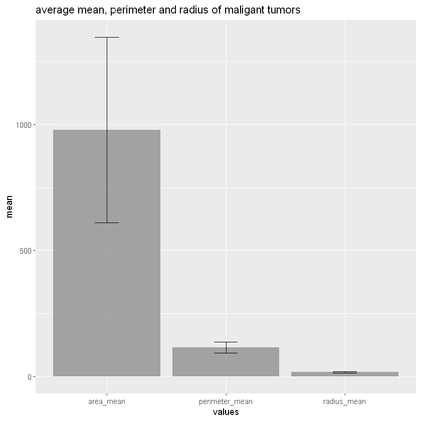
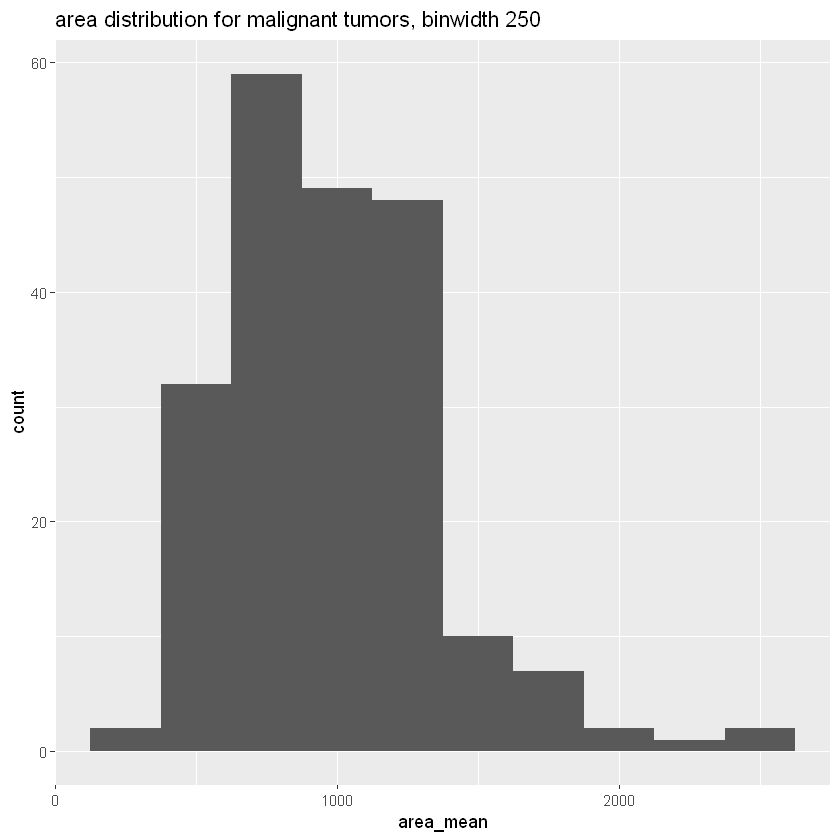
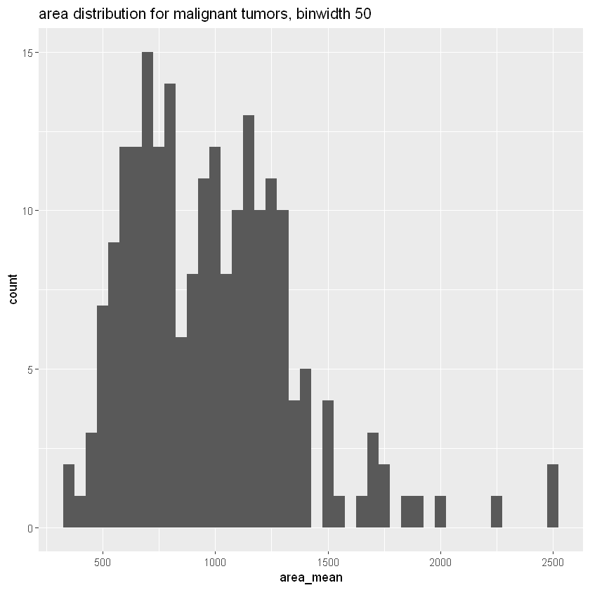
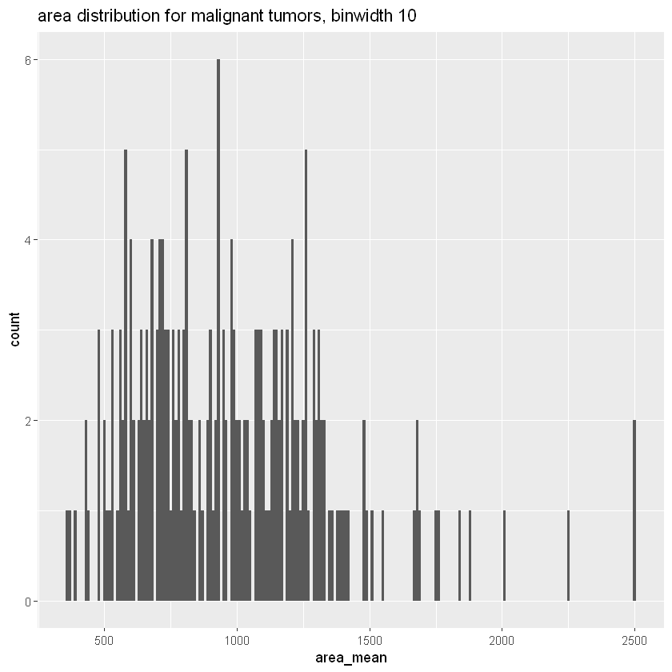
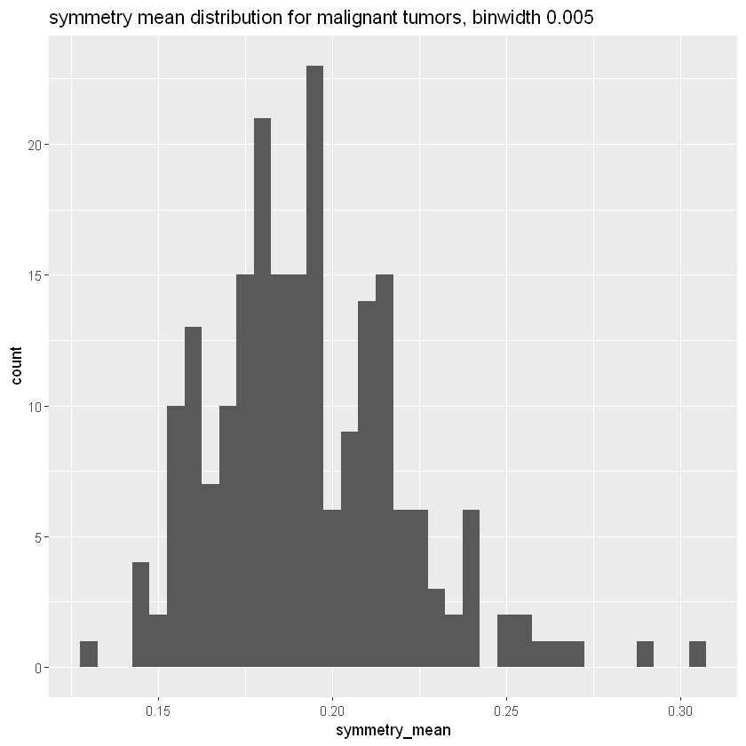
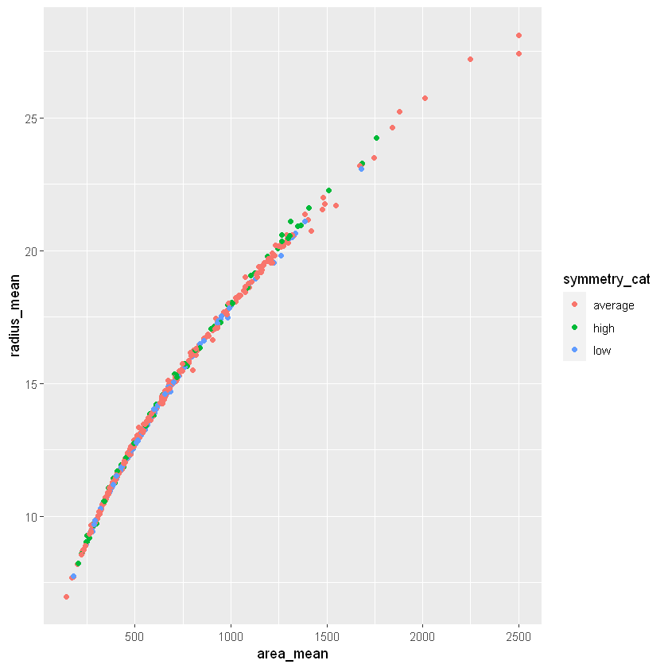
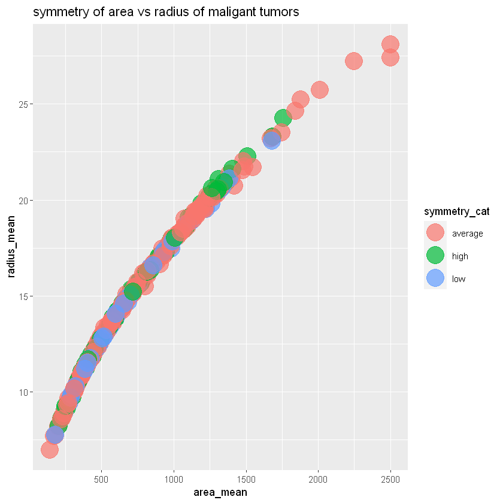

## Title: Mini Project Deliverable 2

install and load required packages 


```R

install.packages("devtools")
devtools::install_github("UBC-MDS/datateachr")

library(datateachr)
library(tidyverse)
```

    Installing package into 'C:/Users/tamil/Documents/R/win-library/4.1'
    (as 'lib' is unspecified)
    
    

    package 'devtools' successfully unpacked and MD5 sums checked
    
    The downloaded binary packages are in
    	C:\Users\tamil\AppData\Local\Temp\RtmpuoE4UY\downloaded_packages
    

    Skipping install of 'datateachr' from a github remote, the SHA1 (78d391f4) has not changed since last install.
      Use `force = TRUE` to force installation
    
    -- Attaching packages --------------------------------------- tidyverse 1.3.1 --
    
    v ggplot2 3.3.5     v purrr   0.3.4
    v tibble  3.1.4     v dplyr   1.0.7
    v tidyr   1.1.4     v stringr 1.4.0
    v readr   2.0.2     v forcats 0.5.1
    
    -- Conflicts ------------------------------------------ tidyverse_conflicts() --
    x dplyr::filter() masks stats::filter()
    x dplyr::lag()    masks stats::lag()
    
    


# Task 1: Process and and summarize your data #

*1.1 First, write out the 4 research questions you defined in milestone 1 were. This will guide your work through milestone 2:*

  1. How is perimeter, radius and area all together related to diagnose a tumor as malignant or benign?
  2. Which features are the driving factor for the diagnosis?
  3. What effects does symmetry have on the radius and area of the sample? 
  4. Looking at the worst factors - how are these different in the diagnosis of the tumor compared to the mean values? 
  
  reminder for cancer_sample using head()


```R
head(cancer_sample)
```


<table class="dataframe">
<caption>A tibble: 6 × 32</caption>
<thead>
	<tr><th scope=col>ID</th><th scope=col>diagnosis</th><th scope=col>radius_mean</th><th scope=col>texture_mean</th><th scope=col>perimeter_mean</th><th scope=col>area_mean</th><th scope=col>smoothness_mean</th><th scope=col>compactness_mean</th><th scope=col>concavity_mean</th><th scope=col>concave_points_mean</th><th scope=col>...</th><th scope=col>radius_worst</th><th scope=col>texture_worst</th><th scope=col>perimeter_worst</th><th scope=col>area_worst</th><th scope=col>smoothness_worst</th><th scope=col>compactness_worst</th><th scope=col>concavity_worst</th><th scope=col>concave_points_worst</th><th scope=col>symmetry_worst</th><th scope=col>fractal_dimension_worst</th></tr>
	<tr><th scope=col>&lt;dbl&gt;</th><th scope=col>&lt;chr&gt;</th><th scope=col>&lt;dbl&gt;</th><th scope=col>&lt;dbl&gt;</th><th scope=col>&lt;dbl&gt;</th><th scope=col>&lt;dbl&gt;</th><th scope=col>&lt;dbl&gt;</th><th scope=col>&lt;dbl&gt;</th><th scope=col>&lt;dbl&gt;</th><th scope=col>&lt;dbl&gt;</th><th scope=col>...</th><th scope=col>&lt;dbl&gt;</th><th scope=col>&lt;dbl&gt;</th><th scope=col>&lt;dbl&gt;</th><th scope=col>&lt;dbl&gt;</th><th scope=col>&lt;dbl&gt;</th><th scope=col>&lt;dbl&gt;</th><th scope=col>&lt;dbl&gt;</th><th scope=col>&lt;dbl&gt;</th><th scope=col>&lt;dbl&gt;</th><th scope=col>&lt;dbl&gt;</th></tr>
</thead>
<tbody>
	<tr><td>  842302</td><td>M</td><td>17.99</td><td>10.38</td><td>122.80</td><td>1001.0</td><td>0.11840</td><td>0.27760</td><td>0.3001</td><td>0.14710</td><td>...</td><td>25.38</td><td>17.33</td><td>184.60</td><td>2019.0</td><td>0.1622</td><td>0.6656</td><td>0.7119</td><td>0.2654</td><td>0.4601</td><td>0.11890</td></tr>
	<tr><td>  842517</td><td>M</td><td>20.57</td><td>17.77</td><td>132.90</td><td>1326.0</td><td>0.08474</td><td>0.07864</td><td>0.0869</td><td>0.07017</td><td>...</td><td>24.99</td><td>23.41</td><td>158.80</td><td>1956.0</td><td>0.1238</td><td>0.1866</td><td>0.2416</td><td>0.1860</td><td>0.2750</td><td>0.08902</td></tr>
	<tr><td>84300903</td><td>M</td><td>19.69</td><td>21.25</td><td>130.00</td><td>1203.0</td><td>0.10960</td><td>0.15990</td><td>0.1974</td><td>0.12790</td><td>...</td><td>23.57</td><td>25.53</td><td>152.50</td><td>1709.0</td><td>0.1444</td><td>0.4245</td><td>0.4504</td><td>0.2430</td><td>0.3613</td><td>0.08758</td></tr>
	<tr><td>84348301</td><td>M</td><td>11.42</td><td>20.38</td><td> 77.58</td><td> 386.1</td><td>0.14250</td><td>0.28390</td><td>0.2414</td><td>0.10520</td><td>...</td><td>14.91</td><td>26.50</td><td> 98.87</td><td> 567.7</td><td>0.2098</td><td>0.8663</td><td>0.6869</td><td>0.2575</td><td>0.6638</td><td>0.17300</td></tr>
	<tr><td>84358402</td><td>M</td><td>20.29</td><td>14.34</td><td>135.10</td><td>1297.0</td><td>0.10030</td><td>0.13280</td><td>0.1980</td><td>0.10430</td><td>...</td><td>22.54</td><td>16.67</td><td>152.20</td><td>1575.0</td><td>0.1374</td><td>0.2050</td><td>0.4000</td><td>0.1625</td><td>0.2364</td><td>0.07678</td></tr>
	<tr><td>  843786</td><td>M</td><td>12.45</td><td>15.70</td><td> 82.57</td><td> 477.1</td><td>0.12780</td><td>0.17000</td><td>0.1578</td><td>0.08089</td><td>...</td><td>15.47</td><td>23.75</td><td>103.40</td><td> 741.6</td><td>0.1791</td><td>0.5249</td><td>0.5355</td><td>0.1741</td><td>0.3985</td><td>0.12440</td></tr>
</tbody>
</table>


*1.2 Now, for each of your four research questions, choose one task from options 1-4 (summarizing), and one other task from 4-8 (graphing).*
You should have 2 tasks done for each research question (8 total). 
Make sure it makes sense to do them! (e.g. don’t use a numerical variables for a task that needs a categorical variable.). 
Comment on why each task helps (or doesn’t!) answer the corresponding research question.
Ensure that the output of each operation is printed!

**1. how perimeter, radius and area related to diagnosing a malignant tumor** I will compute the range, mean, standard deviation, and the variance for tumors that have been filtered to be malignant. The values for perimeter, radius and area are all numerical variables. These summary statistics will be useful in showing me at a glance, how the values may vary simply looking at them, but will not necessarily help with identifying how all of these can be related. So this would be the first step for the future analysis I need to do to answer this question. To avoid writing out every line of summarizing statistics, I will install the pastecs package: 


```R
install.packages("pastecs")
library(pastecs)
```

    Installing package into 'C:/Users/tamil/Documents/R/win-library/4.1'
    (as 'lib' is unspecified)
    
    

    package 'pastecs' successfully unpacked and MD5 sums checked
    
    The downloaded binary packages are in
    	C:\Users\tamil\AppData\Local\Temp\RtmpuoE4UY\downloaded_packages
    

    
    Attaching package: 'pastecs'
    
    
    The following objects are masked from 'package:dplyr':
    
        first, last
    
    
    The following object is masked from 'package:tidyr':
    
        extract
    
    
    

I will then use the stat.desc function from the pastecs package, after selecting the columns of interest


```R
summary_cancer <- cancer_sample %>%
  filter(diagnosis == "M") %>%
  select(radius_mean, area_mean, perimeter_mean) %>%
  stat.desc()
print(summary_cancer)
```

                  radius_mean    area_mean perimeter_mean
    nbr.val       212.0000000    212.00000   2.120000e+02
    nbr.null        0.0000000      0.00000   0.000000e+00
    nbr.na          0.0000000      0.00000   0.000000e+00
    min            10.9500000    361.60000   7.190000e+01
    max            28.1100000   2501.00000   1.885000e+02
    range          17.1600000   2139.40000   1.166000e+02
    sum          3702.1200000 207415.80000   2.445746e+04
    median         17.3250000    932.00000   1.142000e+02
    mean           17.4628302    978.37642   1.153654e+02
    SE.mean         0.2200496     25.27008   1.500984e+00
    CI.mean.0.95    0.4337774     49.81417   2.958845e+00
    var            10.2654308 135378.35537   4.776259e+02
    std.dev         3.2039711    367.93798   2.185465e+01
    coef.var        0.1834738      0.37607   1.894386e-01
    

I will plot a bar graph of the means for every value, and then include the standard deviation as error bars. To make the error bars easier to see, I will adjust the alpha value for the bars to increase the transparency. Having both geom bar and geom errorbar produces a two layered geom graph 


```R
cancer_df <- data.frame(values = c("radius_mean", "area_mean", "perimeter_mean"), mean = c(17.4628302, 978.37642,1.153654e+02), sd = c(3.2039711,367.93798, 2.185465e+01) )

summary_cancer_plot <- ggplot(cancer_df, aes(x = values, y = mean)) +
  geom_bar(stat = "identity", alpha = 0.5) +
  ggtitle("average mean, perimeter and radius of maligant tumors") +
  geom_errorbar(aes(x = values, ymin = mean-sd, ymax = mean+sd), width = 0.2)

print(summary_cancer_plot)
```


    

    


This graph isn't the most useful, because the mean_area is considerably bigger than the others. Overall, I can't answer the question using only the calculations I performed just now. I would have to make this question far more specific, or perform more calculations. although based on what I've done, it seems that this is going into the predictive modeling category, which cannot be done using the tools I currently have. 


**2. Which features are the driving factor for the diagnosis?** Before commencing this analysis, I will count the number of malignant, and the number of benign tumor diagnoses. This is the first step to seeing how much data comparatively I have access to.


```R
cancer_count <- count(cancer_sample)
print(cancer_count)

benign_count <- cancer_sample %>% 
  filter(diagnosis == "B") %>% 
  count() %>%
  print()

malignant_count <- cancer_sample %>%
  filter(diagnosis == "M") %>%
  count() %>%
  print()


diagnosis_count <- bind_cols(benign_count, malignant_count) %>%
  rename(c("benign" = "n...1","malignant" = "n...2")) %>%
  print()
```

    # A tibble: 1 x 1
          n
      <int>
    1   569
    # A tibble: 1 x 1
          n
      <int>
    1   357
    # A tibble: 1 x 1
          n
      <int>
    1   212
    

    New names:
    * n -> n...1
    * n -> n...2
    
    

    # A tibble: 1 x 2
      benign malignant
       <int>     <int>
    1    357       212
    

These counts show that there is a skew toward benign diagnoses, but there is still sufficient malignant observations to come to conclusions. 

 Creating a graph from just the count does not make sense in this context, as the results are already summarized in the tibble. So, I will make a histogram of mean_area for the 212 malignant tumors. With 3 different bin sizes, and determine which one is best.


```R
histo_1 <- cancer_sample %>% 
  filter(diagnosis == "M") %>%
  ggplot(aes(area_mean)) +
  geom_histogram(binwidth = 250) +
  ggtitle("area distribution for malignant tumors, binwidth 250")

histo_2 <- cancer_sample %>% 
  filter(diagnosis == "M") %>%
  ggplot(aes(area_mean)) +
  geom_histogram(binwidth = 50)+
  ggtitle("area distribution for malignant tumors, binwidth 50")

histo_3 <- cancer_sample %>% 
  filter(diagnosis == "M") %>%
  ggplot(aes(area_mean)) +
  geom_histogram(binwidth = 10) +
  ggtitle("area distribution for malignant tumors, binwidth 10")

print(histo_1)
print(histo_2)
print(histo_3)
```


    

    


    

    


    

    


It looks like the second histogram, which uses a binwidth of 50 is the most valuable, as it shows the two main peaks in the data, which the first histogram is not able to capture, and is also general enough, because the third histogram with the smallest bin size becomes too detailed, and peaks and groupings are harder to distinguish. Like the previous question, I do not have enough specificity to answer the question appropriately. 


**3. What effects does symmetry have on the radius and area of the sample?** For this, I want to try and categorize the symmetry into categorical variables - I want to first see the distribution of the symmetry before categorizing 


```R
symmetry_histo <- cancer_sample %>% 
  filter(diagnosis == "M") %>%
  select(symmetry_mean) %>%
  ggplot(aes(symmetry_mean)) +
  geom_histogram(binwidth = .005) +
  ggtitle("symmetry mean distribution for malignant tumors, binwidth 0.005")

  
print(symmetry_histo)
```


    

    


Based on a rough calculation for the histogram I see three peaks, I will temporarily put <0.16 as low symmetry, and >0.21 as high symmetry, with values in between as average symmetry, and look at the values with head to make sure everything makes sense 


```R
symmetry_cancer_cat <- cancer_sample %>% 
  mutate(symmetry_cat = case_when(symmetry_mean < 0.16 ~ "low", 
                                  symmetry_mean > 0.21 ~ "high", 
                                  TRUE ~ "average"))

head(symmetry_cancer_cat)
```


<table class="dataframe">
<caption>A tibble: 6 × 33</caption>
<thead>
	<tr><th scope=col>ID</th><th scope=col>diagnosis</th><th scope=col>radius_mean</th><th scope=col>texture_mean</th><th scope=col>perimeter_mean</th><th scope=col>area_mean</th><th scope=col>smoothness_mean</th><th scope=col>compactness_mean</th><th scope=col>concavity_mean</th><th scope=col>concave_points_mean</th><th scope=col>...</th><th scope=col>texture_worst</th><th scope=col>perimeter_worst</th><th scope=col>area_worst</th><th scope=col>smoothness_worst</th><th scope=col>compactness_worst</th><th scope=col>concavity_worst</th><th scope=col>concave_points_worst</th><th scope=col>symmetry_worst</th><th scope=col>fractal_dimension_worst</th><th scope=col>symmetry_cat</th></tr>
	<tr><th scope=col>&lt;dbl&gt;</th><th scope=col>&lt;chr&gt;</th><th scope=col>&lt;dbl&gt;</th><th scope=col>&lt;dbl&gt;</th><th scope=col>&lt;dbl&gt;</th><th scope=col>&lt;dbl&gt;</th><th scope=col>&lt;dbl&gt;</th><th scope=col>&lt;dbl&gt;</th><th scope=col>&lt;dbl&gt;</th><th scope=col>&lt;dbl&gt;</th><th scope=col>...</th><th scope=col>&lt;dbl&gt;</th><th scope=col>&lt;dbl&gt;</th><th scope=col>&lt;dbl&gt;</th><th scope=col>&lt;dbl&gt;</th><th scope=col>&lt;dbl&gt;</th><th scope=col>&lt;dbl&gt;</th><th scope=col>&lt;dbl&gt;</th><th scope=col>&lt;dbl&gt;</th><th scope=col>&lt;dbl&gt;</th><th scope=col>&lt;chr&gt;</th></tr>
</thead>
<tbody>
	<tr><td>  842302</td><td>M</td><td>17.99</td><td>10.38</td><td>122.80</td><td>1001.0</td><td>0.11840</td><td>0.27760</td><td>0.3001</td><td>0.14710</td><td>...</td><td>17.33</td><td>184.60</td><td>2019.0</td><td>0.1622</td><td>0.6656</td><td>0.7119</td><td>0.2654</td><td>0.4601</td><td>0.11890</td><td>high   </td></tr>
	<tr><td>  842517</td><td>M</td><td>20.57</td><td>17.77</td><td>132.90</td><td>1326.0</td><td>0.08474</td><td>0.07864</td><td>0.0869</td><td>0.07017</td><td>...</td><td>23.41</td><td>158.80</td><td>1956.0</td><td>0.1238</td><td>0.1866</td><td>0.2416</td><td>0.1860</td><td>0.2750</td><td>0.08902</td><td>average</td></tr>
	<tr><td>84300903</td><td>M</td><td>19.69</td><td>21.25</td><td>130.00</td><td>1203.0</td><td>0.10960</td><td>0.15990</td><td>0.1974</td><td>0.12790</td><td>...</td><td>25.53</td><td>152.50</td><td>1709.0</td><td>0.1444</td><td>0.4245</td><td>0.4504</td><td>0.2430</td><td>0.3613</td><td>0.08758</td><td>average</td></tr>
	<tr><td>84348301</td><td>M</td><td>11.42</td><td>20.38</td><td> 77.58</td><td> 386.1</td><td>0.14250</td><td>0.28390</td><td>0.2414</td><td>0.10520</td><td>...</td><td>26.50</td><td> 98.87</td><td> 567.7</td><td>0.2098</td><td>0.8663</td><td>0.6869</td><td>0.2575</td><td>0.6638</td><td>0.17300</td><td>high   </td></tr>
	<tr><td>84358402</td><td>M</td><td>20.29</td><td>14.34</td><td>135.10</td><td>1297.0</td><td>0.10030</td><td>0.13280</td><td>0.1980</td><td>0.10430</td><td>...</td><td>16.67</td><td>152.20</td><td>1575.0</td><td>0.1374</td><td>0.2050</td><td>0.4000</td><td>0.1625</td><td>0.2364</td><td>0.07678</td><td>average</td></tr>
	<tr><td>  843786</td><td>M</td><td>12.45</td><td>15.70</td><td> 82.57</td><td> 477.1</td><td>0.12780</td><td>0.17000</td><td>0.1578</td><td>0.08089</td><td>...</td><td>23.75</td><td>103.40</td><td> 741.6</td><td>0.1791</td><td>0.5249</td><td>0.5355</td><td>0.1741</td><td>0.3985</td><td>0.12440</td><td>average</td></tr>
</tbody>
</table>


Now I will graph the the radius vs area, and colour by the symmetry categories 


```R
area_symmetry_plot <- ggplot(symmetry_cancer_cat, aes(area_mean, radius_mean))+ 
  geom_point(aes(colour = symmetry_cat))

print(area_symmetry_plot)
```


    

    


This is a little bit difficult to see, so I will decrease the alpha value, and increase point size to see easier 


```R
area_symmetry_plot <- ggplot(symmetry_cancer_cat, aes(area_mean, radius_mean))+ 
  geom_point(aes(colour = symmetry_cat), size = 8, alpha = 0.7) +
  ggtitle("symmetry of area vs radius of maligant tumors")
  

print(area_symmetry_plot)
```


    

    


Based on this graph, I see little relationship between the symmetry on the combined factor of radius x mean. While it may seem that low symmetry might be associated with smaller radius and area, it is difficult to say without more analysis. This is likely related to the definition of symmetry I took however, which will need refinement perhaps based on scientific literature in the field. 


**4. Looking at the worst factors - how are these different in the diagnosis of the tumor compared to the mean values? ** I will follow the same calculations that I performed for the first question, as I believe that will be the most valuable. But, I will use the summarize function instead, and only take out the mean values


```R
summary_worst_cancer <- cancer_sample %>%
  filter(diagnosis == "M") %>%
  select(radius_worst, area_worst, perimeter_worst) %>%
  summarize(worst_mean_radius = mean(radius_worst), worst_mean_area = mean(area_worst), worst_mean_perimeter=mean(perimeter_worst))
print(summary_worst_cancer)
```

    # A tibble: 1 x 3
      worst_mean_radius worst_mean_area worst_mean_perimeter
                  <dbl>           <dbl>                <dbl>
    1              21.1           1422.                 141.
    

Now I want to graph these values, together with the values from the previous graph in question 1. I am going to keep adding to my data frame, as it is currently easier for me to graph them. This graph has more than one layer, because of the customization 


```R
cancer_df_worst_avg <- data.frame(values = c("radius_mean", "radius_worst", "area_mean", "area_worst", "perimeter_mean", "perimeter_worst"), mean = c(17.4628302,21.13481, 978.37642, 1422.286, 1.153654e+02, 141.3703))

summary_cancer_plot_worst_avg <- ggplot(cancer_df_worst_avg, aes(x = values, y = mean)) +
  geom_bar(stat = "identity", alpha = 1) +
  ggtitle("worst and average mean, perimeter and radius of maligant tumors") +
  theme_linedraw()

print(summary_cancer_plot_worst_avg)
```


    

    


This was one of the more unhelpful graphs to create, as it is not showing much to me, I believe I would have to do other calculations, for instance I could maybe subtract the values from one another and try to create a variable that would make it a lot easier to compare the change in mean -> worst in a better way. Currently this does not come close to answering my questions. 


*1.3 Based on the operations that you’ve completed, how much closer are you to answering your research questions? *
Think about what aspects of your research questions remain unclear. Can your research questions be refined, now that you’ve investigated your data a bit more? 
Which research questions are yielding interesting results?

I am definitely closer in answering my research questions, but those questions were a little too general, so I will need to redefine them to be more specific, or I will need to consider completing more operations with the data, in addition to what I have done already. I think the questions I want to answer will require additional tools, so I may need to do research outside of class. 

# Task 2: Tidy your data # 
In this task, we will do several exercises to reshape our data. The goal here is to understand how to do this reshaping with the tidyr package.

A reminder of the definition of tidy data:

    Each row is an observation
    Each column is a variable
    Each cell is a value

Tidying data is sometimes necessary because it can simplify computation. Other times it can be nice to organize data so that it can be easier to understand when read manually.

*2.1 Based on the definition above, can you identify if your data is tidy or untidy?*
Go through all your columns, or if you have >8 variables, just pick 8, and explain whether the data is untidy or tidy.

The data is currently tidy - each column is a variable, such as the average radius of the tumor, and is accompanied by a cell that has a single value. Each row denotes an observation, that is tagged with a specific ID. 


```R
quick_look <- cancer_sample %>%
  select(ID, diagnosis, area_mean, perimeter_mean, radius_mean, area_worst, perimeter_worst)

glimpse(quick_look)
```

    Rows: 569
    Columns: 7
    $ ID              <dbl> 842302, 842517, 84300903, 84348301, 84358402, 843786, ~
    $ diagnosis       <chr> "M", "M", "M", "M", "M", "M", "M", "M", "M", "M", "M",~
    $ area_mean       <dbl> 1001.0, 1326.0, 1203.0, 386.1, 1297.0, 477.1, 1040.0, ~
    $ perimeter_mean  <dbl> 122.80, 132.90, 130.00, 77.58, 135.10, 82.57, 119.60, ~
    $ radius_mean     <dbl> 17.990, 20.570, 19.690, 11.420, 20.290, 12.450, 18.250~
    $ area_worst      <dbl> 2019.0, 1956.0, 1709.0, 567.7, 1575.0, 741.6, 1606.0, ~
    $ perimeter_worst <dbl> 184.60, 158.80, 152.50, 98.87, 152.20, 103.40, 153.20,~
    

*2.2 Now, if your data is tidy, untidy it! Then, tidy it back to it’s original state.*

data before I do anything to it - it is currently tidy: 


```R
head(cancer_sample)
```


<table class="dataframe">
<caption>A tibble: 6 × 32</caption>
<thead>
	<tr><th scope=col>ID</th><th scope=col>diagnosis</th><th scope=col>radius_mean</th><th scope=col>texture_mean</th><th scope=col>perimeter_mean</th><th scope=col>area_mean</th><th scope=col>smoothness_mean</th><th scope=col>compactness_mean</th><th scope=col>concavity_mean</th><th scope=col>concave_points_mean</th><th scope=col>...</th><th scope=col>radius_worst</th><th scope=col>texture_worst</th><th scope=col>perimeter_worst</th><th scope=col>area_worst</th><th scope=col>smoothness_worst</th><th scope=col>compactness_worst</th><th scope=col>concavity_worst</th><th scope=col>concave_points_worst</th><th scope=col>symmetry_worst</th><th scope=col>fractal_dimension_worst</th></tr>
	<tr><th scope=col>&lt;dbl&gt;</th><th scope=col>&lt;chr&gt;</th><th scope=col>&lt;dbl&gt;</th><th scope=col>&lt;dbl&gt;</th><th scope=col>&lt;dbl&gt;</th><th scope=col>&lt;dbl&gt;</th><th scope=col>&lt;dbl&gt;</th><th scope=col>&lt;dbl&gt;</th><th scope=col>&lt;dbl&gt;</th><th scope=col>&lt;dbl&gt;</th><th scope=col>...</th><th scope=col>&lt;dbl&gt;</th><th scope=col>&lt;dbl&gt;</th><th scope=col>&lt;dbl&gt;</th><th scope=col>&lt;dbl&gt;</th><th scope=col>&lt;dbl&gt;</th><th scope=col>&lt;dbl&gt;</th><th scope=col>&lt;dbl&gt;</th><th scope=col>&lt;dbl&gt;</th><th scope=col>&lt;dbl&gt;</th><th scope=col>&lt;dbl&gt;</th></tr>
</thead>
<tbody>
	<tr><td>  842302</td><td>M</td><td>17.99</td><td>10.38</td><td>122.80</td><td>1001.0</td><td>0.11840</td><td>0.27760</td><td>0.3001</td><td>0.14710</td><td>...</td><td>25.38</td><td>17.33</td><td>184.60</td><td>2019.0</td><td>0.1622</td><td>0.6656</td><td>0.7119</td><td>0.2654</td><td>0.4601</td><td>0.11890</td></tr>
	<tr><td>  842517</td><td>M</td><td>20.57</td><td>17.77</td><td>132.90</td><td>1326.0</td><td>0.08474</td><td>0.07864</td><td>0.0869</td><td>0.07017</td><td>...</td><td>24.99</td><td>23.41</td><td>158.80</td><td>1956.0</td><td>0.1238</td><td>0.1866</td><td>0.2416</td><td>0.1860</td><td>0.2750</td><td>0.08902</td></tr>
	<tr><td>84300903</td><td>M</td><td>19.69</td><td>21.25</td><td>130.00</td><td>1203.0</td><td>0.10960</td><td>0.15990</td><td>0.1974</td><td>0.12790</td><td>...</td><td>23.57</td><td>25.53</td><td>152.50</td><td>1709.0</td><td>0.1444</td><td>0.4245</td><td>0.4504</td><td>0.2430</td><td>0.3613</td><td>0.08758</td></tr>
	<tr><td>84348301</td><td>M</td><td>11.42</td><td>20.38</td><td> 77.58</td><td> 386.1</td><td>0.14250</td><td>0.28390</td><td>0.2414</td><td>0.10520</td><td>...</td><td>14.91</td><td>26.50</td><td> 98.87</td><td> 567.7</td><td>0.2098</td><td>0.8663</td><td>0.6869</td><td>0.2575</td><td>0.6638</td><td>0.17300</td></tr>
	<tr><td>84358402</td><td>M</td><td>20.29</td><td>14.34</td><td>135.10</td><td>1297.0</td><td>0.10030</td><td>0.13280</td><td>0.1980</td><td>0.10430</td><td>...</td><td>22.54</td><td>16.67</td><td>152.20</td><td>1575.0</td><td>0.1374</td><td>0.2050</td><td>0.4000</td><td>0.1625</td><td>0.2364</td><td>0.07678</td></tr>
	<tr><td>  843786</td><td>M</td><td>12.45</td><td>15.70</td><td> 82.57</td><td> 477.1</td><td>0.12780</td><td>0.17000</td><td>0.1578</td><td>0.08089</td><td>...</td><td>15.47</td><td>23.75</td><td>103.40</td><td> 741.6</td><td>0.1791</td><td>0.5249</td><td>0.5355</td><td>0.1741</td><td>0.3985</td><td>0.12440</td></tr>
</tbody>
</table>


First I will untidy the data, where for each ID, I will put the mean values, se values, and worst values grouped into one column, where it will be clear that instead of each row being a separate observation per ID, each ID/observation will now be repeated over several rows, meaning that the data set is no longer tidy. We end up with significantly more rows, but a lot less columns. I use the pivot_longer() function


```R
untidy_cancer <- cancer_sample %>% 
  pivot_longer(cols = c(-ID, -diagnosis), 
              names_to = "tumor_features", 
              values_to = "values")

print(untidy_cancer)
```

    # A tibble: 17,070 x 4
           ID diagnosis tumor_features            values
        <dbl> <chr>     <chr>                      <dbl>
     1 842302 M         radius_mean              18.0   
     2 842302 M         texture_mean             10.4   
     3 842302 M         perimeter_mean          123.    
     4 842302 M         area_mean              1001     
     5 842302 M         smoothness_mean           0.118 
     6 842302 M         compactness_mean          0.278 
     7 842302 M         concavity_mean            0.300 
     8 842302 M         concave_points_mean       0.147 
     9 842302 M         symmetry_mean             0.242 
    10 842302 M         fractal_dimension_mean    0.0787
    # ... with 17,060 more rows
    


and then tidy it again with the pivot wider() function, where each id/observation will take one row again 


```R
tidy_cancer <- untidy_cancer %>%
  pivot_wider(id_cols = c(-tumor_features, -values), 
              names_from = tumor_features, 
              values_from = values)
print(tidy_cancer)
```

    # A tibble: 569 x 32
             ID diagnosis radius_mean texture_mean perimeter_mean area_mean
          <dbl> <chr>           <dbl>        <dbl>          <dbl>     <dbl>
     1   842302 M                18.0         10.4          123.      1001 
     2   842517 M                20.6         17.8          133.      1326 
     3 84300903 M                19.7         21.2          130       1203 
     4 84348301 M                11.4         20.4           77.6      386.
     5 84358402 M                20.3         14.3          135.      1297 
     6   843786 M                12.4         15.7           82.6      477.
     7   844359 M                18.2         20.0          120.      1040 
     8 84458202 M                13.7         20.8           90.2      578.
     9   844981 M                13           21.8           87.5      520.
    10 84501001 M                12.5         24.0           84.0      476.
    # ... with 559 more rows, and 26 more variables: smoothness_mean <dbl>,
    #   compactness_mean <dbl>, concavity_mean <dbl>, concave_points_mean <dbl>,
    #   symmetry_mean <dbl>, fractal_dimension_mean <dbl>, radius_se <dbl>,
    #   texture_se <dbl>, perimeter_se <dbl>, area_se <dbl>, smoothness_se <dbl>,
    #   compactness_se <dbl>, concavity_se <dbl>, concave_points_se <dbl>,
    #   symmetry_se <dbl>, fractal_dimension_se <dbl>, radius_worst <dbl>,
    #   texture_worst <dbl>, perimeter_worst <dbl>, area_worst <dbl>, ...
    

*2.3 Now, you should be more familiar with your data, and also have made progress in answering your research questions.* 
Based on your interest, and your analyses, pick 2 of the 4 research questions to continue your analysis in milestone 3, and explain your decision.
Try to choose a version of your data that you think will be appropriate to answer these 2 questions in milestone 3. 

I will be studying questions 2 and 4, because I believe they  are related to each, but also seem to have substantial enough differences that I would want to continue to investigate. While 1 and 3 were also interesting, I did not want to continue the analysis based on what I found during the investigation in this milestone. Question 1 was very valuable in setting up further development and analysis for questions 2 and 4. 

 
  2. Which features are the driving factor for the diagnosis? - I don't believe I had enough room in this milestone to investigate this question further, but did establish some graphing parameters that I will use in the next analysis. Going off what I found in question 1, I want to use some of the techniques from that question for this one, but more streamlined. 
  4. Looking at the worst factors - how are these different in the diagnosis of the tumor compared to the mean values? When I compared just a few of these factors with the ones in question 1, and I believe looking at more factors in comparison to those I will specify for question 2 will yield some interesting results.
  
I will make these two questions more specific after the investigation today, as I believe they may be beginning to touch on modeling techniques, that may be outside the scope of what we are currently doing. 


```R

```
