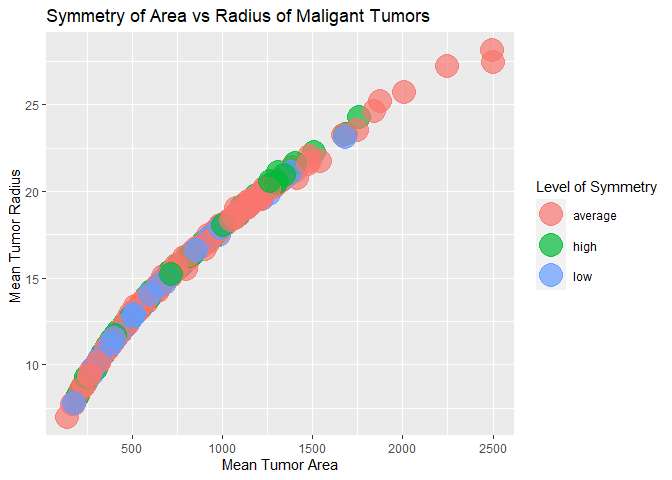
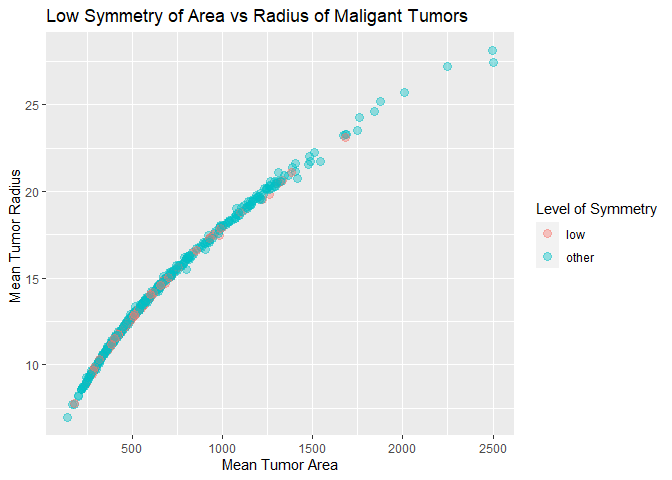
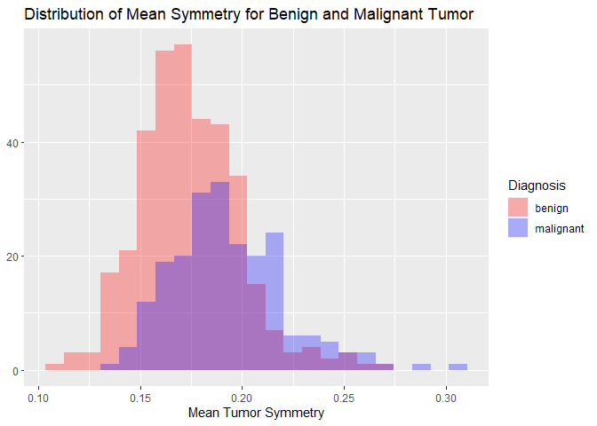
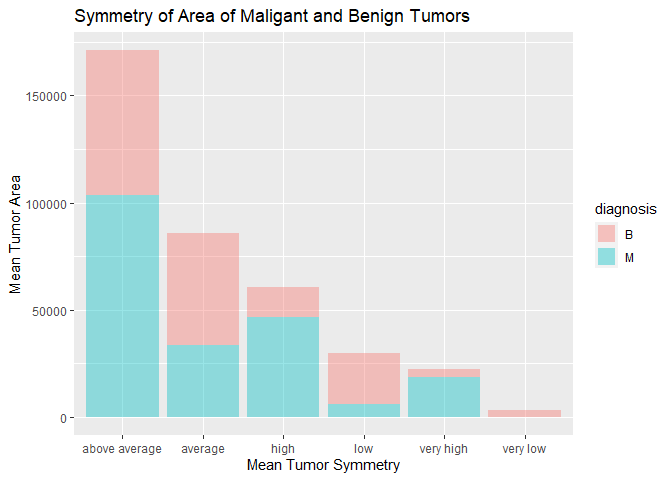
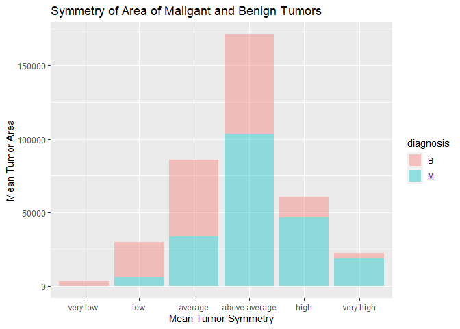

# Welcome to your last milestone in your mini data analysis project!

In Milestone 1, you explored your data and came up with research questions. In Milestone 2, you obtained some results by making summary tables and graphs. 

In this (3rd) milestone, you'll be sharpening some of the results you obtained from your previous milestone by:

+ Manipulating special data types in R: factors and/or dates and times. 
+ Fitting a model object to your data, and extract a result.
+ Reading and writing data as separate files.

**NOTE**: The main purpose of the mini data analysis is to integrate what you learn in class in an analysis. Although each milestone provides a framework for you to conduct your analysis, it's possible that you might find the instructions too rigid for your data set. If this is the case, you may deviate from the instructions -- just make sure you're demonstrating a wide range of tools and techniques taught in this class.

## Instructions

**To complete this milestone**, edit [this very `.Rmd` file](https://raw.githubusercontent.com/UBC-STAT/stat545.stat.ubc.ca/master/content/mini-project/mini-project-3.Rmd) directly. Fill in the sections that are tagged with `<!--- start your work here--->`. 

**To submit this milestone**, make sure to knit this `.Rmd` file to an `.md` file by changing the YAML output settings from `output: html_document` to `output: github_document`. Commit and push all of your work to your mini-analysis GitHub repository, and tag a release on GitHub. Then, submit a link to your tagged release on canvas. 

**Points**: This milestone is worth 40 points (compared to the usual 30 points): 30 for your analysis, and 10 for your entire mini-analysis GitHub repository. Details follow.

**Research Questions**: In Milestone 2, you chose two research questions to focus on. Wherever realistic, your work in this milestone should relate to these research questions whenever we ask for justification behind your work. In the case that some tasks in this milestone don't align well with one of your research questions, feel free to discuss your results in the context of a different research question.


# Setup

Begin by loading your data and the tidyverse package below: 


```r
library(datateachr)
library(tidyverse)
```

From Milestone 2, you chose two research questions. What were they? Put them here.

<!-------------------------- Start your work below ---------------------------->
1. Which "mean_" features are the driving factor for the diagnosis?
2. Looking at the "worst_" factors - how are these different in the diagnosis of the tumor compared to the "mean_" values?
<!----------------------------------------------------------------------------->


# Exercise 1: Special Data Types (10)

For this exercise, you'll be choosing two of the three tasks below -- both tasks that you choose are worth 5 points each. 

But first, tasks 1 and 2 below ask you to modify a plot you made in a previous milestone. The plot you choose should involve plotting across at least three groups (whether by facetting, or using an aesthetic like colour). Place this plot below (you're allowed to modify the plot if you'd like). If you don't have such a plot, you'll need to make one. Place the code for your plot below.

<!-------------------------- Start your work below ---------------------------->
I will be using one of my plots where I broke up a numerical value into categories, where each group is a different colour

```r
#change numerical symmetry variable into a categorical 
symmetry_cancer_cat <- cancer_sample %>% 
  mutate(symmetry_cat = case_when(symmetry_mean < 0.16 ~ "low", 
                                  symmetry_mean > 0.21 ~ "high", 
                                  TRUE ~ "average"))

head(symmetry_cancer_cat)
```

```
## # A tibble: 6 x 33
##         ID diagnosis radius_mean texture_mean perimeter_mean area_mean
##      <dbl> <chr>           <dbl>        <dbl>          <dbl>     <dbl>
## 1   842302 M                18.0         10.4          123.      1001 
## 2   842517 M                20.6         17.8          133.      1326 
## 3 84300903 M                19.7         21.2          130       1203 
## 4 84348301 M                11.4         20.4           77.6      386.
## 5 84358402 M                20.3         14.3          135.      1297 
## 6   843786 M                12.4         15.7           82.6      477.
## # ... with 27 more variables: smoothness_mean <dbl>, compactness_mean <dbl>,
## #   concavity_mean <dbl>, concave_points_mean <dbl>, symmetry_mean <dbl>,
## #   fractal_dimension_mean <dbl>, radius_se <dbl>, texture_se <dbl>,
## #   perimeter_se <dbl>, area_se <dbl>, smoothness_se <dbl>,
## #   compactness_se <dbl>, concavity_se <dbl>, concave_points_se <dbl>,
## #   symmetry_se <dbl>, fractal_dimension_se <dbl>, radius_worst <dbl>,
## #   texture_worst <dbl>, perimeter_worst <dbl>, area_worst <dbl>, ...
```

```r
#plot 
area_symmetry_plot <- ggplot(symmetry_cancer_cat, aes(area_mean, radius_mean))+ 
  geom_point(aes(colour = symmetry_cat), size = 8, alpha = 0.7) +
  ggtitle("Symmetry of Area vs Radius of Maligant Tumors") +
  scale_x_continuous(
    name = "Mean Tumor Area"
  )+
  scale_y_continuous(
    name = "Mean Tumor Radius "
  ) +
  labs(color = "Level of Symmetry")
print(area_symmetry_plot)
```

<!-- -->


<!----------------------------------------------------------------------------->

Now, choose two of the following tasks.

1. Produce a new plot that reorders a factor in your original plot, using the `forcats` package (3 points). Then, in a sentence or two, briefly explain why you chose this ordering (1 point here for demonstrating understanding of the reordering, and 1 point for demonstrating some justification for the reordering, which could be subtle or speculative.)

2. Produce a new plot that groups some factor levels together into an "other" category (or something similar), using the `forcats` package (3 points). Then, in a sentence or two, briefly explain why you chose this grouping (1 point here for demonstrating understanding of the grouping, and 1 point for demonstrating some justification for the grouping, which could be subtle or speculative.)

3. If your data has some sort of time-based column like a date (but something more granular than just a year):
    1. Make a new column that uses a function from the `lubridate` or `tsibble` package to modify your original time-based column. (3 points)
        - Note that you might first have to _make_ a time-based column using a function like `ymd()`, but this doesn't count.
        - Examples of something you might do here: extract the day of the year from a date, or extract the weekday, or let 24 hours elapse on your dates.
    2. Then, in a sentence or two, explain how your new column might be useful in exploring a research question. (1 point for demonstrating understanding of the function you used, and 1 point for your justification, which could be subtle or speculative).
        - For example, you could say something like "Investigating the day of the week might be insightful because penguins don't work on weekends, and so may respond differently".
    


<!-------------------------- Start your work below ---------------------------->

**Task Number**:2.Produce a new plot that groups some factor levels together into an "other" category using the 'forcats' package 

```r
#reorder the previously high and average values, will create this from the original data set 
symmetry_cancer_cat_fct <- cancer_sample %>% 
  mutate(symmetry_cat_fct = factor(case_when(symmetry_mean < 0.16 ~ "low", 
                                  TRUE ~ "other")))

head(symmetry_cancer_cat_fct)
```

```
## # A tibble: 6 x 33
##         ID diagnosis radius_mean texture_mean perimeter_mean area_mean
##      <dbl> <chr>           <dbl>        <dbl>          <dbl>     <dbl>
## 1   842302 M                18.0         10.4          123.      1001 
## 2   842517 M                20.6         17.8          133.      1326 
## 3 84300903 M                19.7         21.2          130       1203 
## 4 84348301 M                11.4         20.4           77.6      386.
## 5 84358402 M                20.3         14.3          135.      1297 
## 6   843786 M                12.4         15.7           82.6      477.
## # ... with 27 more variables: smoothness_mean <dbl>, compactness_mean <dbl>,
## #   concavity_mean <dbl>, concave_points_mean <dbl>, symmetry_mean <dbl>,
## #   fractal_dimension_mean <dbl>, radius_se <dbl>, texture_se <dbl>,
## #   perimeter_se <dbl>, area_se <dbl>, smoothness_se <dbl>,
## #   compactness_se <dbl>, concavity_se <dbl>, concave_points_se <dbl>,
## #   symmetry_se <dbl>, fractal_dimension_se <dbl>, radius_worst <dbl>,
## #   texture_worst <dbl>, perimeter_worst <dbl>, area_worst <dbl>, ...
```

```r
#plot 
area_symmetry_plot <- ggplot(symmetry_cancer_cat_fct, aes(area_mean, radius_mean))+ 
  geom_point(aes(colour = symmetry_cat_fct), size = 3, alpha = 0.4) +
  ggtitle("Low Symmetry of Area vs Radius of Maligant Tumors") +
  scale_x_continuous(
    name = "Mean Tumor Area"
  )+
  scale_y_continuous(
    name = "Mean Tumor Radius "
  ) +
  labs(color = "Level of Symmetry")
print(area_symmetry_plot)
```

<!-- -->

Why you chose this grouping: This was the only categorical value plot that I had, so I addressed this set of data, looking at symmetry. Grouping the symmetry values seemed like a logical next step, because looking only at 3 values did not yield any substansive conclusions

Justification for the grouping, which could be subtle or speculative: Looking at the previous graph, differentiating between the average and high values did not provide any additional information, so I wanted to see if specifically the low values could provide some interesting outcomes - i.e. if there was a grouping of one low symmetry tumors when graphing the radius and area together. This graph did not provide any significant results.


<!----------------------------------------------------------------------------->


<!-------------------------- Start your work below ---------------------------->

**Task Number**: 1. Produce a new plot that reorders a factor in your original plot, using the `forcats` package


```r
#I need to recreate another set of categorical values, because currently I only have either 2 or 3 categorical values, where it will not make sense to reorder any factors. This will be the set up stage for this step, I'll look at the radius mean distribution first 

malignant <- cancer_sample %>% 
  filter(diagnosis == "M")
benign <- cancer_sample %>% 
  filter(diagnosis == "B")

combined_data <- dplyr::bind_rows(list(malignant=malignant,benign=benign), .id="Diagnosis")
head(combined_data)
```

```
## # A tibble: 6 x 33
##   Diagnosis       ID diagnosis radius_mean texture_mean perimeter_mean area_mean
##   <chr>        <dbl> <chr>           <dbl>        <dbl>          <dbl>     <dbl>
## 1 malignant   842302 M                18.0         10.4          123.      1001 
## 2 malignant   842517 M                20.6         17.8          133.      1326 
## 3 malignant 84300903 M                19.7         21.2          130       1203 
## 4 malignant 84348301 M                11.4         20.4           77.6      386.
## 5 malignant 84358402 M                20.3         14.3          135.      1297 
## 6 malignant   843786 M                12.4         15.7           82.6      477.
## # ... with 26 more variables: smoothness_mean <dbl>, compactness_mean <dbl>,
## #   concavity_mean <dbl>, concave_points_mean <dbl>, symmetry_mean <dbl>,
## #   fractal_dimension_mean <dbl>, radius_se <dbl>, texture_se <dbl>,
## #   perimeter_se <dbl>, area_se <dbl>, smoothness_se <dbl>,
## #   compactness_se <dbl>, concavity_se <dbl>, concave_points_se <dbl>,
## #   symmetry_se <dbl>, fractal_dimension_se <dbl>, radius_worst <dbl>,
## #   texture_worst <dbl>, perimeter_worst <dbl>, area_worst <dbl>, ...
```

```r
radius_histo <- ggplot(combined_data,aes(symmetry_mean,fill=Diagnosis))+
  scale_fill_manual(values=c("red","blue"))+
  geom_histogram(alpha=0.3,binwidth=0.009,position="identity")+
    scale_x_continuous(
    name = "Mean Tumor Symmetry"
  )+
  scale_y_continuous(
    name = NULL
  ) +
  labs(color = "Diagnosis")+
  ggtitle("Distribution of Mean Symmetry for Benign and Malignant Tumor ")


print(radius_histo)
```

<!-- -->

```r
#Now I will create new categorical factors for the symmetry data 

symmetry_cancer_fct <- cancer_sample %>% 
  mutate(symmetry_fct = factor(case_when(symmetry_mean < 0.13 ~ "very low",
                                         symmetry_mean < 0.15 ~ "low", 
                                         symmetry_mean < 0.17 ~ "average", 
                                         symmetry_mean < 0.2 ~ "above average", 
                                         symmetry_mean < 0.23 ~ "high",
                                         
                                  TRUE ~ "very high")))

head(symmetry_cancer_fct)
```

```
## # A tibble: 6 x 33
##         ID diagnosis radius_mean texture_mean perimeter_mean area_mean
##      <dbl> <chr>           <dbl>        <dbl>          <dbl>     <dbl>
## 1   842302 M                18.0         10.4          123.      1001 
## 2   842517 M                20.6         17.8          133.      1326 
## 3 84300903 M                19.7         21.2          130       1203 
## 4 84348301 M                11.4         20.4           77.6      386.
## 5 84358402 M                20.3         14.3          135.      1297 
## 6   843786 M                12.4         15.7           82.6      477.
## # ... with 27 more variables: smoothness_mean <dbl>, compactness_mean <dbl>,
## #   concavity_mean <dbl>, concave_points_mean <dbl>, symmetry_mean <dbl>,
## #   fractal_dimension_mean <dbl>, radius_se <dbl>, texture_se <dbl>,
## #   perimeter_se <dbl>, area_se <dbl>, smoothness_se <dbl>,
## #   compactness_se <dbl>, concavity_se <dbl>, concave_points_se <dbl>,
## #   symmetry_se <dbl>, fractal_dimension_se <dbl>, radius_worst <dbl>,
## #   texture_worst <dbl>, perimeter_worst <dbl>, area_worst <dbl>, ...
```

```r
#plot 
area_symmetry_plot_2 <- ggplot(symmetry_cancer_fct, aes(symmetry_fct, area_mean))+ 
  geom_col(aes(fill = diagnosis), size = 3, alpha = 0.4) +
  ggtitle("Symmetry of Area of Maligant and Benign Tumors") +
  labs(x = "Mean Tumor Symmetry", y = "Mean Tumor Area")
  
print(area_symmetry_plot_2)
```

<!-- -->
The Graph above does not have the mean symmetry in order, but alphabetical, which is not logical in observing this data set, so I will reorder using the forcats package - this will be ordered according to ascending worst  area, because I wanted to try and relate this to my research question  

```r
reorder_cancer_symmetry <- symmetry_cancer_fct %>%
   mutate(symmetry_fct = fct_reorder(symmetry_fct, area_worst, mean, .desc = FALSE))

head(reorder_cancer_symmetry)
```

```
## # A tibble: 6 x 33
##         ID diagnosis radius_mean texture_mean perimeter_mean area_mean
##      <dbl> <chr>           <dbl>        <dbl>          <dbl>     <dbl>
## 1   842302 M                18.0         10.4          123.      1001 
## 2   842517 M                20.6         17.8          133.      1326 
## 3 84300903 M                19.7         21.2          130       1203 
## 4 84348301 M                11.4         20.4           77.6      386.
## 5 84358402 M                20.3         14.3          135.      1297 
## 6   843786 M                12.4         15.7           82.6      477.
## # ... with 27 more variables: smoothness_mean <dbl>, compactness_mean <dbl>,
## #   concavity_mean <dbl>, concave_points_mean <dbl>, symmetry_mean <dbl>,
## #   fractal_dimension_mean <dbl>, radius_se <dbl>, texture_se <dbl>,
## #   perimeter_se <dbl>, area_se <dbl>, smoothness_se <dbl>,
## #   compactness_se <dbl>, concavity_se <dbl>, concave_points_se <dbl>,
## #   symmetry_se <dbl>, fractal_dimension_se <dbl>, radius_worst <dbl>,
## #   texture_worst <dbl>, perimeter_worst <dbl>, area_worst <dbl>, ...
```

```r
#plot 
area_symmetry_plot_3 <- ggplot(reorder_cancer_symmetry, aes(symmetry_fct, area_mean))+ 
  geom_col(aes(fill = diagnosis), size = 3, alpha = 0.4) +
  ggtitle("Symmetry of Area of Maligant and Benign Tumors") +
  labs(x = "Mean Tumor Symmetry", y = "Mean Tumor Area")
  
print(area_symmetry_plot_3)
```

<!-- -->


why you chose this ordering: I wanted to stick to the categorical values that I explored earlier, I did not want to deviate too far from the graph I defined at the start of the exercise, so I decided to finish off with looking at symmetry. I picked these specific values for ordering purely for exploratory reasons 
justification for the reordering, which could be subtle or speculative: The ordering that I had to begin with was not helpful in looking at the data visually, I also wanted to try and relate this exercise to one of my research questions regarding the "worst_" factors, which I did here

<!----------------------------------------------------------------------------->

    

# Exercise 2: Modelling

## 2.0 (no points)

Pick a research question, and pick a variable of interest (we'll call it "Y") that's relevant to the research question. Indicate these.

<!-------------------------- Start your work below ---------------------------->

**Research Question**: Looking at the "worst_" factors - how are these different in the diagnosis of the tumor compared to the "mean_" values?

**Variable of interest**: area_worst, radius_worst, area_mean, radius_mean, filtered for malignant diagnoses 

<!----------------------------------------------------------------------------->

## 2.1 (5 points)

Fit a model or run a hypothesis test that provides insight on this variable with respect to the research question. Store the model object as a variable, and print its output to screen. We'll omit having to justify your choice, because we don't expect you to know about model specifics in STAT 545. 

- **Note**: It's OK if you don't know how these models/tests work. Here are some examples of things you can do here, but the sky's the limit. 
    - You could fit a model that makes predictions on Y using another variable, by using the `lm()` function.
    - You could test whether the mean of Y equals 0 using `t.test()`, or maybe the mean across two groups are different using `t.test()`, or maybe the mean across multiple groups are different using `anova()` (you may have to pivot your data for the latter two).
    - You could use `lm()` to test for significance of regression.

<!-------------------------- Start your work below ---------------------------->


```r
#I will see the statistical significance between two means: for the area_worst variable. I will compare the malignant vs benign tumor group 

worst_area_malignant <- cancer_sample %>% 
  filter(diagnosis == "M") %>%
  select(area_worst) 
worst_area_benign <- cancer_sample %>% 
  filter(diagnosis == "B") %>%
  select(area_worst) 


print(worst_area_malignant)
```

```
## # A tibble: 212 x 1
##    area_worst
##         <dbl>
##  1      2019 
##  2      1956 
##  3      1709 
##  4       568.
##  5      1575 
##  6       742.
##  7      1606 
##  8       897 
##  9       739.
## 10       711.
## # ... with 202 more rows
```

```r
print(worst_area_benign)
```

```
## # A tibble: 357 x 1
##    area_worst
##         <dbl>
##  1       711.
##  2       630.
##  3       315.
##  4       546.
##  5       242.
##  6       583.
##  7       699.
##  8       516.
##  9       657.
## 10       527.
## # ... with 347 more rows
```

```r
ttest_worst_area <- t.test(worst_area_malignant, worst_area_benign, alternative = "two.sided", conf.level = 0.95)

print(ttest_worst_area)
```

```
## 
## 	Welch Two Sample t-test
## 
## data:  worst_area_malignant and worst_area_benign
## t = 20.571, df = 229.91, p-value < 2.2e-16
## alternative hypothesis: true difference in means is not equal to 0
## 95 percent confidence interval:
##  780.6890 946.0847
## sample estimates:
## mean of x mean of y 
## 1422.2863  558.8994
```

<!----------------------------------------------------------------------------->

## 2.2 (5 points)

Produce something relevant from your fitted model: either predictions on Y, or a single value like a regression coefficient or a p-value. 

- Be sure to indicate in writing what you chose to produce. 
- Your code should either output a tibble (in which case you should indicate the column that contains the thing you're looking for), or the thing you're looking for itself.
- Obtain your results using the `broom` package if possible. If your model is not compatible with the broom function you're needing, then you can obtain your results by some other means, but first indicate which broom function is not compatible. 
  
<!-------------------------- Start your work below ---------------------------->

When running a t-test, I will need to report the p value if I aim to present this somewhere. For that, I want to tidy the summary statistics from the ttest into something tidy, I will use the broom::tidy() function. This will produce a tibble, from which I will find the p.value column 

```r
answ2.2 <- broom::tidy(ttest_worst_area)
print(answ2.2)
```

```
## # A tibble: 1 x 10
##   estimate estimate1 estimate2 statistic  p.value parameter conf.low conf.high
##      <dbl>     <dbl>     <dbl>     <dbl>    <dbl>     <dbl>    <dbl>     <dbl>
## 1     863.     1422.      559.      20.6 4.94e-54      230.     781.      946.
## # ... with 2 more variables: method <chr>, alternative <chr>
```

```r
#the p value can be called for like so 
answ2.2$p.value
```

```
## [1] 4.937924e-54
```

<!----------------------------------------------------------------------------->


# Exercise 3: Reading and writing data

Get set up for this exercise by making a folder called `output` in the top level of your project folder / repository. You'll be saving things there. 

## 3.1 (5 points)

Take a summary table that you made from Milestone 2 (Exercise 1.2), and write it as a csv file in your `output` folder. Use the `here::here()` function.

- **Robustness criteria**: You should be able to move your Mini Project repository / project folder to some other location on your computer, or move this very Rmd file to another location within your project repository / folder, and your code should still work.
- **Reproducibility criteria**: You should be able to delete the csv file, and remake it simply by knitting this Rmd file. 
  
<!-------------------------- Start your work below ---------------------------->


```r
here::here()
```

```
## [1] "C:/Users/tamil/Desktop/STAT545/mda-tami-kali"
```

```r
#"C:/Users/tamil/Desktop/STAT545/mda-tami-kali"
benign_count <- cancer_sample %>% 
  filter(diagnosis == "B") %>% 
  count() 
malignant_count <- cancer_sample %>%
  filter(diagnosis == "M") %>%
  count() 
diagnosis_count <- bind_cols(benign_count, malignant_count) %>%
  rename(c("benign" = "n...1","malignant" = "n...2"))
```

```
## New names:
## * n -> n...1
## * n -> n...2
```

```r
write_csv(diagnosis_count, here::here("output", "milestone2_exercise_summary_table.csv"))
# View files in output folder
dir(here::here("output"))
```

```
## [1] "milestone2_exercise_summary_table.csv"
## [2] "milestone3_model_object.rds"          
## [3] "README.md"
```

<!----------------------------------------------------------------------------->

## 3.2 (5 points)

Write your model object from Exercise 2 to an R binary file (an RDS), and load it again. Be sure to save the binary file in your `output` folder. Use the functions `saveRDS()` and `readRDS()`. 

- The same robustness and reproducibility criteria as in 3.1 apply here.

<!-------------------------- Start your work below ---------------------------->


```r
saveRDS(ttest_worst_area, here::here("output", "milestone3_model_object.rds"))
dir(here::here("output"))
```

```
## [1] "milestone2_exercise_summary_table.csv"
## [2] "milestone3_model_object.rds"          
## [3] "README.md"
```

<!----------------------------------------------------------------------------->

# Tidy Repository

Now that this is your last milestone, your entire project repository should be organized. Here are the criteria we're looking for.

## Main README (3 points)

There should be a file named `README.md` at the top level of your repository. Its contents should automatically appear when you visit the repository on GitHub. 

Minimum contents of the README file:

- In a sentence or two, explains what this repository is, so that future-you or someone else stumbling on your repository can be oriented to the repository.
- In a sentence or two (or more??), briefly explains how to engage with the repository. You can assume the person reading knows the material from STAT 545A. Basically, if a visitor to your repository wants to explore your project, what should they know?

Once you get in the habit of making README files, and seeing more README files in other projects, you'll wonder how you ever got by without them! They are tremendously helpful.

## File and Folder structure (3 points)

You should have at least four folders in the top level of your repository: one for each milestone, and one output folder. If there are any other folders, these are explained in the main README.

Each milestone document is contained in its respective folder, and nowhere else. 

Every level-1 folder (that is, the ones stored in the top level, like "Milestone1" and "output") has a `README` file, explaining in a sentence or two what is in the folder, in plain language (it's enough to say something like "This folder contains the source for Milestone 1").

## Output (2 points)

All output is recent and relevant: 

- All Rmd files have been `knit`ted to their output, and all data files saved from Exercise 3 above appear in the `output` folder. 
- All of these output files are up-to-date -- that is, they haven't fallen behind after the source (Rmd) files have been updated.
- There should be no relic output files. For example, if you were knitting an Rmd to html, but then changed the output to be only a markdown file, then the html file is a relic and should be deleted. 

Our recommendation: delete all output files, and re-knit each milestone's Rmd file, so that everything is up to date and relevant. 

PS: there's a way where you can run all project code using a single command, instead of clicking "knit" three times. More on this in STAT 545B!

## Error-free code (1 point)

This Milestone 3 document knits error-free. (We've already graded this aspect for Milestone 1 and 2)

## Tagged release (1 point)

You've tagged a release for Milestone 3. (We've already graded this aspect for Milestone 1 and 2)
